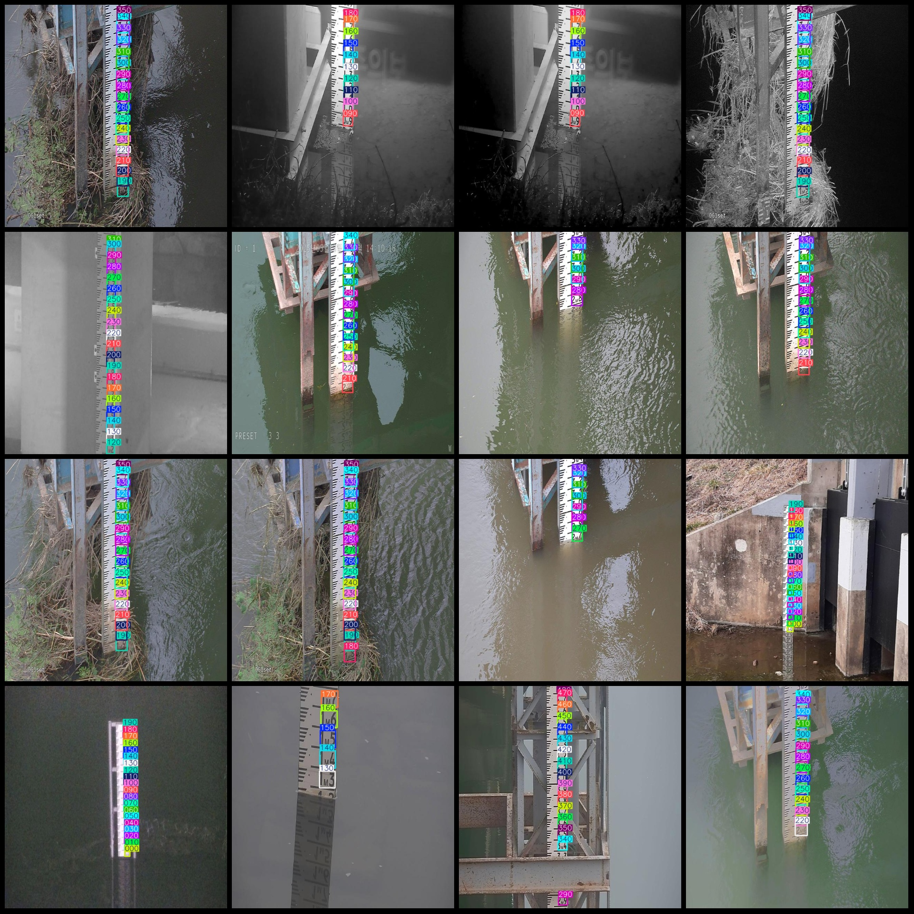
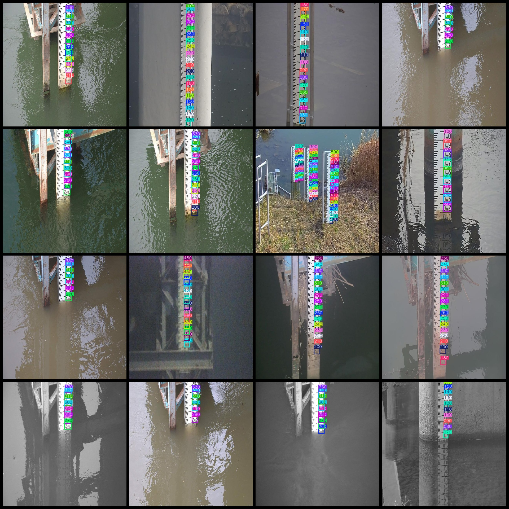

# Land Surface Water Level Readings and Monitoring Data Set in VOC+YOLO Format with 493 Images and 60 Categories

The dataset is in VOC+ format for the YOLOv4 annotation dataset, including 60 categories of water level scale readings. There are 21 images per category for annotation, and each image is provided along with its corresponding YOLOv4 configuration file and yolo format txt file. The resolution of the images in the dataset is 640x640. The annotation rules are to label a box around each category, with a total of 60 annotations per category. The dataset does not have separate training, validation, or test sets; users need to partition them according to their needs. The dataset does not guarantee the accuracy of the trained model or weight files.
## Images

Here is a pay link on Stripe ( https://buy.stripe.com/3cs8yP7sY87d0vu9AB ). Please contact me lonlonago@foxmail.com after funding $89, and I will send you a complete data files , thank you!

